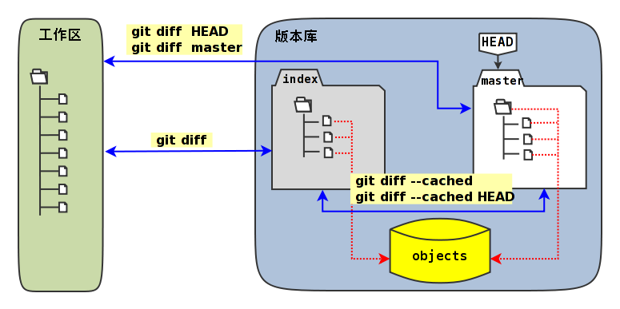

# Git原理

[Git配置](#Git_Config)

## 1.预备知识
### 1.1 SHA1
　　安全哈希算法（Secure Hash Algorithm）主要适用于数字签名标准（Digital Signature Standard DSS）里面定义的数字签名算法（Digital Signature Algorithm DSA）。对于长度小于2^64位的消息，SHA1会产生一个160位的消息摘要。当接收到消息的时候，这个消息摘要可以用来验证数据的完整性。  
　　**SHA1有如下特性：**  
　　不可以从消息摘要中复原信息；  
　　两个不同的消息不会产生同样的消息摘要,(但会有1x10 ^ 48分之一的机率出现相同的消息摘要,一般使用时忽略)。
### 1.2 blob
　　BLOB (binary large object)，二进制大对象，是一个可以存储二进制文件的容器。  
    处理BLOB的主要思想就是让文件处理器（如数据库管理器）不去理会文件是什么，而是关心如何去处理它。

## 2.Git基础要点
### 2.1 直接快照，而非比较差异
Git 和其他版本控制系统的主要差别在于，Git 只关心文件数据的整体是否发生变化，而
大多数其他系统则只关心文件内容的具体差异。  
这类系统（CVS，Subversion，Perforce，Bazaar等等）每次记录有哪些文件作了更新，以及都更新了哪些行的什么内容，如下图所示：  


Git 并不保存这些前后变化的差异数据。实际上，Git 更像是把变化的文件作快照后，记
录在一个微型的文件系统中。每次提交更新时，它会纵览一遍所有文件的指纹信息并对文件
作一快照，然后保存一个指向这次快照的索引。为提高性能，若文件没有变化，Git 不会再
次保存，而只对上次保存的快照作一连接。Git 的工作方式如下图所示。


### 2.2 分布式版本控制
Git客户端并不只提取最新版本的文件快照，而是把原始的代码仓库完整地镜像下来。  
这么一来，任何一处协同工作用的服务器发生故障，事后都可以用任何一个镜像出来的本地仓库恢复。  
因为每一次的提取操作，实际上都是一次对代码仓库的完整备份。


## 3.Git仓库(远程仓库和本地仓库)
Git不像SVN那样有个中心服务器。每个客户端都包含了完整的代码仓库，所有的提交操作都是在本地进行，提交的记录和变更都保存在本地仓库中。  
但在协作开发时，需要将修改的代码和日志记录分享给其他成员时，需要推送给远程仓库。远程仓库可以是一个集中管理的服务器，也可以是项目组的其他成员的本地仓库。

创建本地仓库有两种方式：
* git init

git init 命令创建一个新的 Git 仓库。它用来将已存在但还没有版本控制的项目转换成一个 Git 仓库，或者创建一个空的新仓库。<br>
运行 git init 命令会在你项目的根目录下创建一个新的 .git 目录，其中包含了你项目必需的所有元数据。除了 .git 目录之外，已经存在的项目不会被改变
```
git init
git init <directory>
```
运行这个命令会创建一个名为 directory，只包含 .git 子目录的空目录。

```
git init --bare <directory>
```
初始化一个裸的 Git 仓库，但是忽略工作目录。共享的仓库应该总是用 --bare 标记创建（见下面的讨论）。一般来说，用 —bare 标记初始化的仓库以 .git 结尾。比如，一个叫my-project的仓库，它的空版本应该保存在 my-project.git 目录下。

裸仓库

-—bare 标记创建了一个没有工作目录的仓库，这样我们在仓库中更改文件并且提交了。中央仓库应该总是创建成裸仓库，因为向非裸仓库推送分支有可能会覆盖已有的代码变动。将-—bare看成是用来将仓库标记为储存设施，而不是一个开发环境。也就是说，对于所有的 Git 工作流，中央仓库是裸仓库，开发者的本地仓库是非裸仓库。


* git clone

git clone 命令拷贝整个 Git 仓库。<br>
clone 自动创建了一个名为 origin 的远程连接，指向原有仓库。


## 4.Git分支(远程分支、远程跟踪分支和本地分支)
远程分支位于远程的仓库中。
远程跟踪分支和本地分支位于本地的仓库。

|类型|通过更新|通过发布|客户端访问|
|---|---|---|---|
|远程跟踪分支|git fetch, git pull |不发布|只读|
|本地分支|git merge, git pull|git push|读写|


## 5.Git区域（仓库、暂存区和工作区)
本地仓库由 git 维护的三棵“树”组成。第一个是你的 工作目录，它持有实际文件；第二个是 暂存区（Index），它像个缓存区域，临时保存你的改动；最后是 HEAD，它指向你最后一次提交的结果。


## 6.Git操作


Git工作流程：<br>


### 6.1 本地操作


### 6.2 远程操作
* git pull

* git fetch

* git merge

* git rebase

git pull = git fetch + git merge
git pull --rebase = git fetch + git rebase


```
git checkout feature
git merge master
```


```
git checkout feature
git rebase master
```


### 6.3 撤销操作
* git checkout

有三个不同的作用：检出文件、检出提交和检出分支。<br>
检出分支：
```git checkout master```
回到master分支。将HEAD指针指向master分支。<br>

检出文件：
```git checkout <commit> <file>```
查看文件之前的版本。它将工作目录中的<file>文件变成<commit>中那个文件的拷贝，并将它加入缓存区。

检出提交：
```git checkout <commit>```
更新工作目录中的所有文件，使得和某个特定提交中的文件一致。你可以将提交的哈希字串，或是标签作为<commit>参数。这会使你处在分离HEAD的状态。


* git reset

提交层面：<br>


文件层面：<br>


* git revert

只有提交层面的操作，没有文件层面的操作。<br>
通过创建一个新的提交，来撤销一个原来的提交。这是一种安全的撤销修改的方式，因为它不会改写提交历史。<br>
```
git checkout hotfix
git revert HEAD~2
```


|Command	|Scope	|Common use cases|
|-----------|-------|----------------|
|git reset	|Commit-level	|Discard commits in a private branch or throw away uncommited changes|
|git reset	|File-level	|Unstage a file|
|git checkout|	Commit-level	|Switch between branches or inspect old snapshots|
|git checkout|	File-level	|Discard changes in the working directory|
|git revert	|Commit-level	|Undo commits in a public branch|
|git revert	|File-level	|(N/A)|


### 6.4 比较差异




## 7.Git对象
### 7.1 文件对象(blob)

### 7.2 树(tree)对象

### 7.3 提交(commit)对象

### 7.4 标签(tag)对象


## 8.Git配置

## 9. 开发及Gerrit入库流程
### 9.1 切换到master分支

```
git checkout master
```

### 9.2 更新到最新版本

```
git pull origin master
```

### 9.3 创建临时开发分支

```
git checkout -b develop
```

### 9.4 临时开发分支下修改代码


### 9.5 提交代码到本地开发分支
```
git add
git commit -m "xxxxxxx"
```
 
### 9.6 获取远端master分支最新版本到本地
```
git fetch origin master
```
 
### 9.7 rebase
```
git rebase origin/master
```
    如果rebase过程中有冲突，解决冲突后
```
git rebase --continue
```

**注意：
  如果开发工作持续很多天，建议每天将改动merge到开发分支后，重复执行9.6-9.7步骤**
 
### 9.8 切换到master分支
```
git checkout master
```
 
### 9.9 更新本地master分支代码到最新版本
```
git pull
```
 
### 9.10 merge develop分支到本地的master分支 
```
git merge develop
```
 
### 9.11 push代码提交到gerrit评审分支
```
git push origin HEAD:refs/for/master
```

### 9.12 如果gerrit检查不过需要修改当前的提交
```
git checkout develop
//修改代码
git add
git commit --amend
git fetch origin master
git rebase origin/master

git checkout master
git reset --hard HEAD^1
git pull
git merge develop
git push origin HEAD:refs/for/master
```

